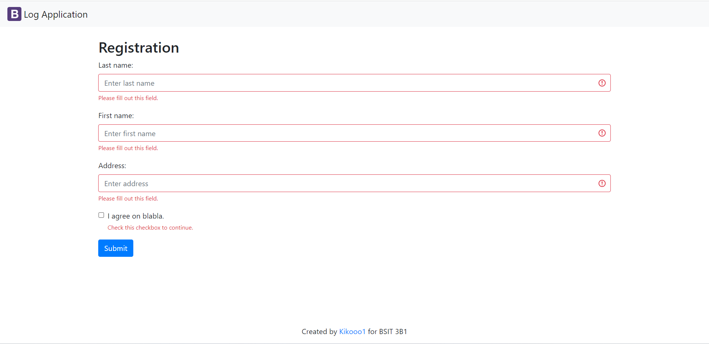

# LOG-APP-SCALING-OCTO

***

## DESCRIPTION
The Log App is an application designed to help users  
compile data related to Covid Tracking within a particular establishment.

***
## VISUALS

[Login](index.php "guestbook-login.php") Page 
 

***

[Registration](index.php "index.php") Page
 

***

[List](index.php "index.php") Registered Data
 

***

## Installation

Set up a database that is only accessible locally, and create two tables within it called "account" and "person"

 

***

### Database

The Web Application was hosted locally using xampp.

 

***

## AUTHOR

__Allan Joseph D. Amon__ :heart:
